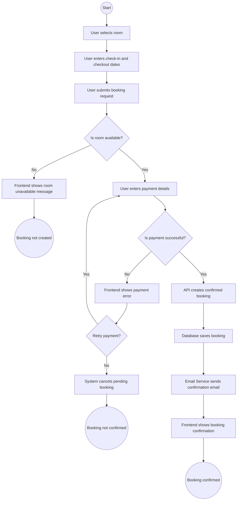
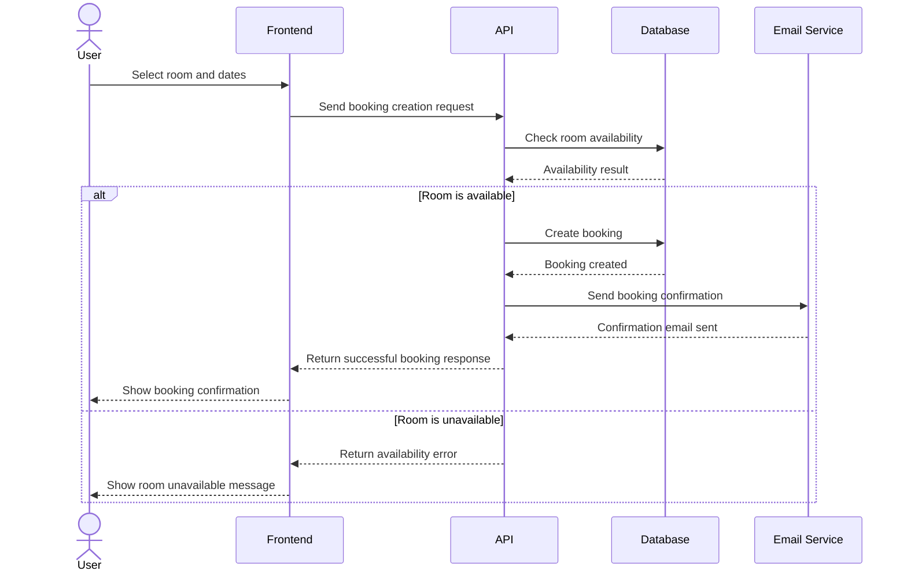
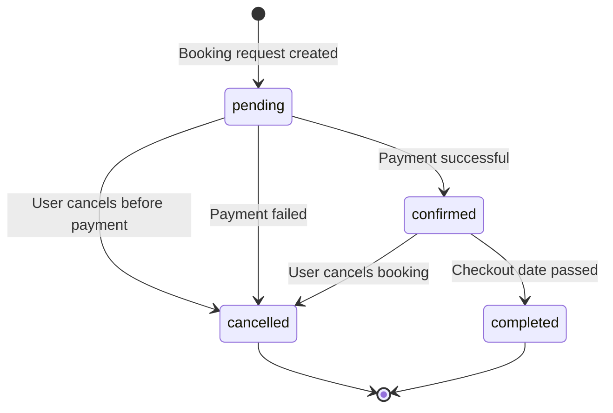

# Task 5: Booking Process Documentation and Diagrams

## BPMN: Booking Creation and Cancellation Process

The diagram describes the main user flow for creating a booking and two exception paths:

- room is not available;
- payment is not successful.

## Sequence Diagram: Booking Creation

## State Transition: Booking Object

## State Transition Test Coverage

The following Booking state transitions should be covered by tests:

- `pending -> confirmed`: verifies that a booking is confirmed only after successful payment and successful room availability check.
- `pending -> cancelled`: verifies cancellation before payment and cancellation after failed payment.
- `confirmed -> cancelled`: verifies that a user can cancel an active confirmed booking according to business rules.
- `confirmed -> completed`: verifies that the system correctly completes a booking after the checkout date has passed.

Negative transition checks are also important: the system should not allow `cancelled -> confirmed`, `completed -> cancelled`, or creation of a `confirmed` booking when the room is unavailable or payment fails.
